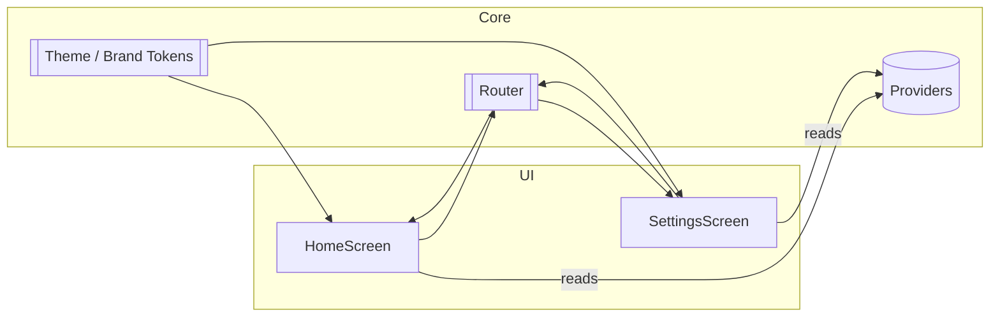

# Flutter Enterprise App

```text
███████╗██╗     ██╗   ██╗████████╗████████╗██████╗ ███████╗██╗     ██████╗ ███████╗
██╔════╝██║     ██║   ██║╚══██╔══╝╚══██╔══╝██╔══██╗██╔════╝██║     ██╔══██╗██╔════╝
█████╗  ██║     ██║   ██║   ██║      ██║   ██████╔╝█████╗  ██║     ██████╔╝█████╗  
██╔══╝  ██║     ██║   ██║   ██║      ██║   ██╔══██╗██╔══╝  ██║     ██╔══██╗██╔══╝  
███████╗███████╗╚██████╔╝   ██║      ██║   ██║  ██║███████╗███████╗██║  ██║███████╗
╚══════╝╚══════╝ ╚═════╝    ╚═╝      ╚═╝   ╚═╝  ╚═╝╚══════╝╚══════╝╚═╝  ╚═╝╚══════╝
```

A modern, tier‑grade Flutter starter for enterprise apps with:
- Material 3 adaptive UI (light/dark)
- Riverpod state management
- go_router navigation (shell with tabs)
- L10n (ARB) internationalization
- Strong linting and CI via GitHub Actions
- Golden tests using Alchemist

## Screenshots / Visuals

<p align="center">
  
</p>

> Tip: replace `assets/readme/hero.png` with your own 3D render or mockup to achieve a “3D visual” README effect.

## Architecture (Mermaid)



## Getting started

- Install Flutter
- Enable web (optional): `flutter config --enable-web`
- Install deps: `flutter pub get`
- Generate l10n: `flutter gen-l10n`
- Run: `flutter run`

## Testing

```bash
flutter test
```

Golden tests are under `test/golden`. Update baselines with:

```bash
flutter test --update-goldens
```

## Project structure

- `lib/core/brand.dart` — design tokens (colors, spacing, motion)
- `lib/core/theme.dart` — Material 3 themes
- `lib/router.dart` — go_router setup with shell + tabs
- `lib/ui/` — screens and widgets
- `lib/l10n/` — ARB localization files

## CI

See `.github/workflows/ci.yml` for format, analyze, and tests on PRs.
